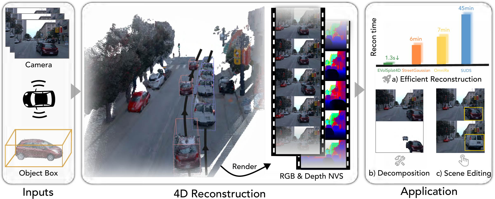

<h1 align="center">EVolSplat4D: Efficient Volume-based Gaussian Splatting for 4D Urban Scene Synthesis (IJCV 2026)</h1>

<p align="center">
  
</p>

[](https://arxiv.org/abs/2601.15951)

[Sheng Miao](https://miaosheng1.github.io/), Sijin Li, Pan Wang, Dongfeng Bai, Bingbing Liu, [Yue Wang](https://ywang-zju.github.io/), [Andreas Geiger](https://www.cvlibs.net/) and [Yiyi Liao](https://yiyiliao.github.io/)

Our project page is available [here](https://xdimlab.github.io/EVolSplat4D/).



## :book: Datasets

This release supports inference on prepared [Waymo](https://waymo.com/open/) and PandaSet scenes. Download the prepared scenes from our [Hugging Face dataset](https://huggingface.co/datasets/cookiemiao/EVolSplat4D). Follow the [Waymo preprocessing instructions](Preprocess/README.md) to prepare images, DINO features, point-cloud priors, and object trajectories from raw Waymo data.

For dynamic-object 3D bounding-box estimation and tracking, we follow [Street Gaussians](https://github.com/zju3dv/street_gaussians#preprocess-the-data). Please refer to their preprocessing instructions for tracking predictions.

The dataset should have the following structure:

```text
├── $PATH_TO_YOUR_DATASET
    ├── $SCENE_0
        ├── front_images/*.png
        ├── feature_map/*.pt
        ├── fg_mask/*.png                   # training masks
        ├── input_pcd/Drop50/Static.npz     # training and static inference
        ├── input_pcd/Drop80/Static.npz     # dynamic inference
        ├── input_pcd/track_info.pth        # dynamic scenes only
        ├── transforms.json
    ...
    ├── $SCENE_N
        ├── front_images/*.png
        ├── feature_map/*.pt
        ├── input_pcd/
        ├── transforms.json
```

## :house: Installation

EVolSplat4D builds on [nerfstudio](https://github.com/nerfstudio-project/nerfstudio). The following instructions use Linux and an NVIDIA GPU.

#### Create environment

Create a conda environment with Python 3.10. Project dependencies are listed in [`pyproject.toml`](pyproject.toml).

```bash
conda create --name EVolSplat4D -y python=3.10
conda activate EVolSplat4D
pip install --upgrade pip
pip install setuptools==78.1.1 wheel numpy==1.26.0
```

#### Dependencies

##### Install PyTorch

Use PyTorch 2.5.1 with CUDA 12.1. Install a CUDA 12.1 toolkit with `nvcc` before building the CUDA extensions.

```bash
pip install torch==2.5.1 torchvision==0.20.1 --index-url https://download.pytorch.org/whl/cu121
```

##### Install TorchSparse

Install [TorchSparse](https://github.com/mit-han-lab/torchsparse) 2.1.0 with SparseHash headers:

```bash
sudo apt-get install build-essential libsparsehash-dev
pip install ninja backports.cached-property tqdm typing-extensions
pip install --no-build-isolation 'git+https://github.com/mit-han-lab/torchsparse.git@385f5ce8718fcae93540511b7f5832f4e71fd835'
```

##### Install gsplat

Install [gsplat](https://github.com/nerfstudio-project/gsplat) 1.3.0:

```bash
pip install --no-build-isolation gsplat==1.3.0
```

#### Install EVolSplat4D

Install PyTorch3D and EVolSplat4D from source with a CUDA GPU visible:

```bash
pip install fvcore iopath
pip install --no-build-isolation 'git+https://github.com/facebookresearch/pytorch3d.git@v0.7.7'
git clone https://github.com/Miaosheng1/EVolSplat4D.git
cd EVolSplat4D
pip install --no-build-isolation -e .
```

## :chart_with_upwards_trend: Evaluation & Checkpoint

Download our pretrained model from [huggingface](https://huggingface.co/cookiemiao/EVolSplat4D/tree/main) and place it at `weight/pretrain_waymo.ckpt`. 
### ✈️ Feed-forward Inference

Replace `$PATH_TO_YOUR_SCENE` with a prepared scene directory containing `transforms.json`.

#### Dynamic scenes (Waymo / PandaSet)

For dynamic scenes, use Drop80:

```bash
python nerfstudio/scripts/infer_4d.py evolsplat4d \
  --load_checkpoint weight/pretrain_waymo.ckpt \
  --config_file config/evolsplat4d_dynamic.yaml \
  --pipeline.model.freeze_volume=True \
  evolsplat4d-zeroshot-data \
  --data "$PATH_TO_YOUR_SCENE" \
  --eval_mode drop80
```

#### Static scenes (Waymo)

For static Waymo scenes, use Drop50 with the same checkpoint. The static configuration disables dynamic modeling and does not require trajectories:

```bash
python nerfstudio/scripts/infer_4d.py evolsplat4d \
  --load_checkpoint weight/pretrain_waymo.ckpt \
  --config_file config/evolsplat4d_static.yaml \
  --pipeline.model.freeze_volume=True \
  evolsplat4d-zeroshot-data \
  --data "$PATH_TO_YOUR_SCENE" \
  --eval_mode drop50
```


## Training

Prepare training sequences following [`Preprocess/README.md`](Preprocess/README.md). We provide multi-scene training with Drop50 point-cloud priors:

```bash
ns-train evolsplat4d \
  --descriptor unified_depth_input_rigid \
  --max_num_iterations 50000 \
  --steps_per_eval_image 2000 \
  --steps_per_save 10000 \
  --config_file config/evolsplat4d_dynamic.yaml \
  --data "$PATH_TO_YOUR_DATASET"
```

Set `dataparser.num_scenes` in `config/evolsplat4d_dynamic.yaml` to match your prepared training set. Alternatively, set the data root in `train.sh` and run `bash train.sh`.

## 📢 News

* 2026-09-18: Accepted by IJCV!

* 2026-10-02: Officially released all code and the [pretrained model](https://huggingface.co/cookiemiao/EVolSplat4D)!

## :clipboard: Citation

If you find EVolSplat4D useful for your research, please consider citing:

```bibtex
@article{miao2026evolsplat4d,
  title={{EVolSplat4D}: Efficient Volume-based Gaussian Splatting for {4D} Urban Scene Synthesis},
  author={Miao, Sheng and Li, Sijin and Wang, Pan and Bai, Dongfeng and Liu, Bingbing and Wang, Yue and Geiger, Andreas and Liao, Yiyi},
  journal={International Journal of Computer Vision},
  year={2026},
  note={Accepted for publication},
  url={https://arxiv.org/abs/2601.15951}
}
```

## :sparkles: Acknowledgement

- This project builds on [EVolSplat](https://github.com/Miaosheng1/EVolSplat), [nerfstudio](https://github.com/nerfstudio-project/nerfstudio), and [gsplat](https://github.com/nerfstudio-project/gsplat).
- We also thank [TorchSparse](https://github.com/mit-han-lab/torchsparse) and [PyTorch3D](https://github.com/facebookresearch/pytorch3d) for their implementations.
